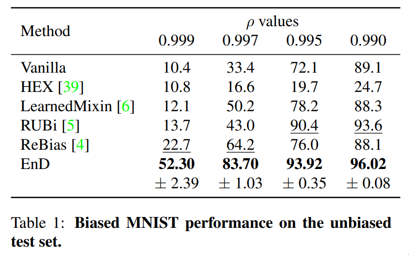

# Entangling and Disentangling deep representations for bias correction (CVPR21)

<!--[](https://arxiv.org/abs/2103.02023)-->

Official repository for **EnD** | [[pdf](https://openaccess.thecvf.com/content/CVPR2021/papers/Tartaglione_EnD_Entangling_and_Disentangling_Deep_Representations_for_Bias_Correction_CVPR_2021_paper.pdf)] [[supp](https://openaccess.thecvf.com/content/CVPR2021/supplemental/Tartaglione_EnD_Entangling_and_CVPR_2021_supplemental.pdf)]

Enzo Tartaglione<sup>1</sup>, Carlo Alberto Barbano<sup>1</sup>, Marco Grangetto<sup>1</sup>

1<sub>University of Turin, Computer Science dept.</sub>
<br/><br/><br/>

<p>
Artificial neural networks perform state-of-the-art in an ever-growing number of tasks, and nowadays they are used to solve an incredibly large variety of tasks. There are problems, like the presence of biases in the training data, which question the generalization capability of these models. In this work we propose EnD, a regularization strategy whose aim is to prevent deep models from learning unwanted biases. In particular, we insert an ""information bottleneck"" at a certain point of the deep neural network, where we disentangle the information about the bias, still letting the useful information for the training task forward-propagating in the rest of the model. One big advantage of EnD is that it does not require additional training complexity (like decoders or extra layers in the model), since it is a regularizer directly applied on the trained model. Our experiments show that EnD effectively improves the generalization on unbiased test sets, and it can be effectively applied on real-case scenarios, like removing hidden biases in the COVID-19 detection from radiographic images.
</p>

<center>

</center>
<br/>

## Prerequisites

```
pip3 install -r requirements.txt
```

## Running

<center>

</center>

**Note**: *Anonymous mode for https://wandb.ai seems not to be working at the moment. An account is suggested*

To create the sweep (hyperparameter search):

```
wandb sweep sweeps/biased_mnist_abs.yaml
```

To change the value of rho, edit sweeps/biased_mnist_abs.yaml accordingly.
We recommend searching alpha and beta in the range [0;1] for rho=0.990,0.995,0.997 and
[0;50] for rho=0.999.

To launch one or more agents

```
wandb agent <sweep_id>
```

We recommend at least 20 runs, to let the hyperparameters search converge.

## Visualizing results

From wandb.ai, and to see final results:

```
python3 results.py <sweep_id>
```

Example output:

```
    valid_acc  biased_test_acc  unbiased_test_acc     state        id
51   0.839778           0.9997             0.8501  finished  wtb1t9kr
55   0.825611           0.9996             0.8361  finished  u5oslxfp
51   0.821111           0.9999             0.8249  finished  j8wj5jyg
. . .
. . .
------- SUMMARY FOR EnD-cvpr21/Biased MNIST - rho 0.997 - EnD -------
biased_test_acc: 99.97 ± 0.01
unbiased_test_acc: 83.70 ± 1.03

```

## Running a local instance

```
python3 EnD_rebias_mnist_sweep.py --local --alpha 0.1 --beta 0.1
```

More CLI arguments can be found in **configs.py**

## Citing

For citing our work, please use the following bibtex entry:

```bibtex
@InProceedings{Tartaglione_2021_CVPR,
    author    = {Tartaglione, Enzo and Barbano, Carlo Alberto and Grangetto, Marco},
    title     = {EnD: Entangling and Disentangling Deep Representations for Bias Correction},
    booktitle = {Proceedings of the IEEE/CVF Conference on Computer Vision and Pattern Recognition (CVPR)},
    month     = {June},
    year      = {2021},
    pages     = {13508-13517}
}
```
